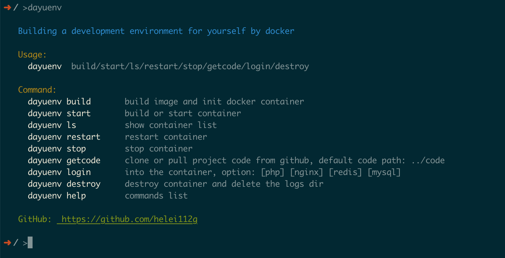
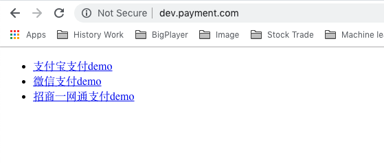

Docker搭建的PHP7开发环境。

# Env
  - PHP 7.2.6
  - Redis 3.2.11
  - MySql 5.7.22
  - Nginx 1.14.0

# PHP Extensions
  - Phalcon 直接可使用该镜像用于该框架的开发工作
  - Yaf 直接可用于开发Yaf框架项目
  - Redis 扩展
  - igbinary 扩展，更高效的序列化函数
  - xdebug 扩展，方便调试

# Install

获取项目
```
git clone git@github.com:helei112g/docker-env.git
```

设置系统别名
```
alias dayuenv=/yourpath/docker-env/dayuenv.sh
```
设置别名的目的是为了能够像系统命令一样的方便使用，效果:
<p align="center">
  
</p>

# Usage

上面的截图的命令已经很清晰展示了各个命令，对部分命令重点说下

1. `dayuenv build` 首次安装该项目后，需要通过该命令来创建docker镜像，创建完成后会自动启动所有容器
2. `dayuenv start` 镜像创建后，每次运行该命令启动容器即可
3. `dayuenv login` 提供的登录容器内部的命令
4. `dayuenv destroy` 用于删除容器，删除后使用 `dayuenv start` 会再次自动创建容器。*注意：该命令不会删除镜像*

**dayuenv getcode** 需要重点说下，大家注意在目录下有一个文件：`code.conf` 这是用于配置自己的代码仓库路径，便于更新。
```
git@github.com:helei112g/payment.git   master  www/payment

```
以这个配置为例，当运行 `dayuenv getcode` 命令时，如果这个项目存在，会自动进行更新。如果不存在则会自动 clone 下来。你可以把自己的代码仓库放在这里，方便统一管理

# Dirs
以我自己电脑的开发目录结构给大家做个展示，我将 **docker** 环境的配置信息与代码 **code** 目录放在同一级别。

```
├── code
│   ├── gocode // 存放go相关代码
│   ├── python // 存放python相关代码
│   └── www // php代码
│       ├── payment
│       └── x-api
└── docker-env
    ├── README.md
    ├── code.conf
    ├── code.conf.bak
    ├── command
    ├── dayuenv.sh
    ├── demo1.png
    ├── docker-compose.yml
    ├── docker-compose.yml.bak
    ├── getcode.log
    ├── golang
    ├── logs
    ├── mysql
    ├── nginx
    ├── php7
    └── redis
```

# Other
为了让大家快速体验项目，项目中设置了 **[payment](https://github.com/helei112g/payment)** 项目的配置。启动容器后，你可以通过 `dayuenv getcode` 获取到最新的代码。然后绑定 `dev.payment.com` 域名到你的host。在浏览器中访问，就能运行payment这个项目了。

*PS: payment项目需要使用composer安装相关的依赖*

<p align="center">
  
</p>